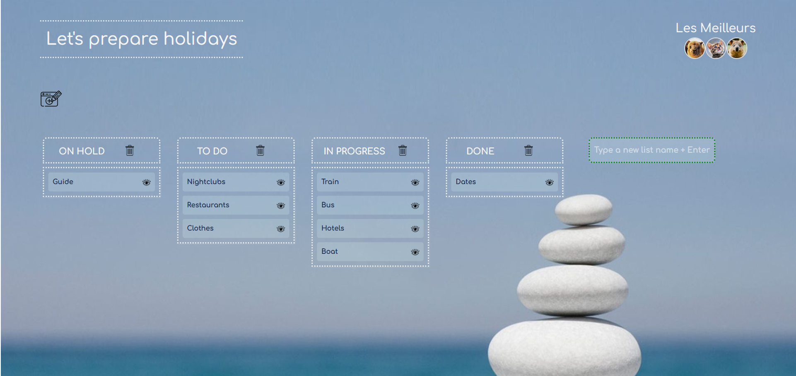

# A-trello-type-dashboard-with-Vue.js-Vuex-and-Vue-draggable



Student Project: Create an interactive dashboard where you can create, update and delete lists of notes based on trello model. Data is stored using the Wordpress API. 

## Project setup
```
npm install
```

### Compiles and hot-reloads for development
```
npm run serve
```

### Compiles and minifies for production
```
npm run build
```

### Lints and fixes files
```
npm run lint
```

### Customize configuration
See [Configuration Reference](https://cli.vuejs.org/config/).
